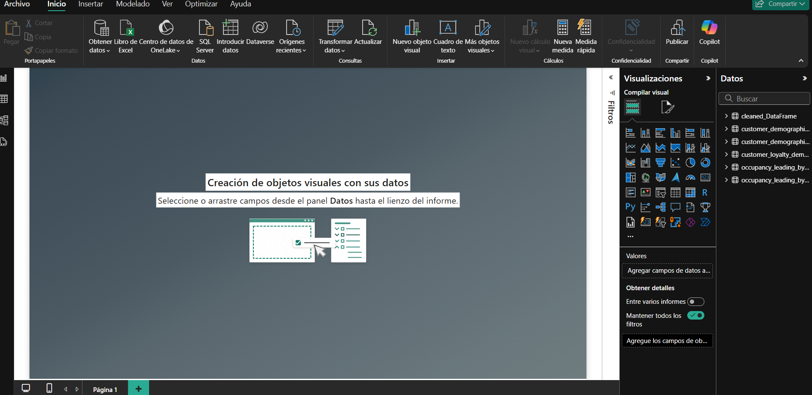
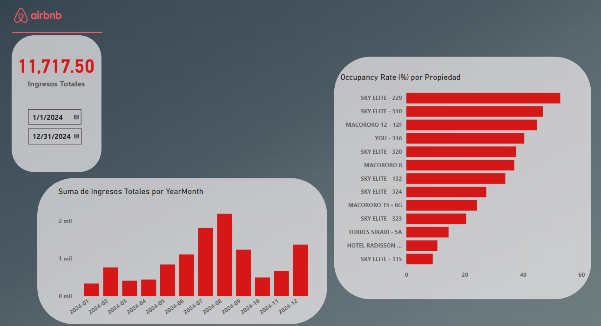

# AIRBNB Dashboard for data analysis
It's aims is to find insights from the data we have about the properties offered on AirBNB

# Blank Canvas with the tables needed for the analysis already imported
We will begin with the visualization of the data

# First canvas for general anlysis, Range of dates, total earnings, earnings per year/month, occupancy rate % per property
