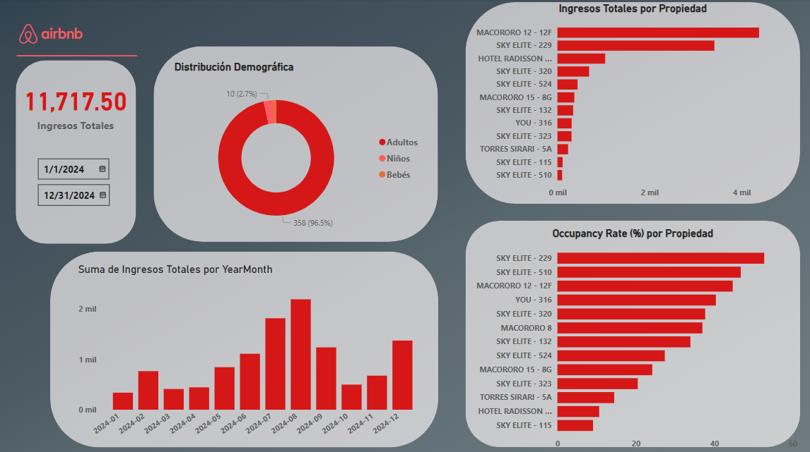
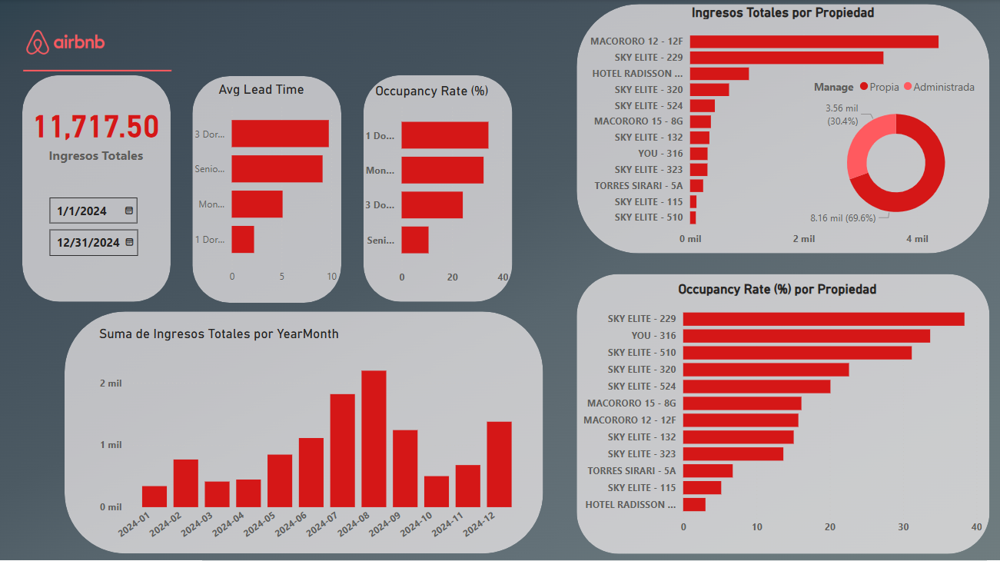
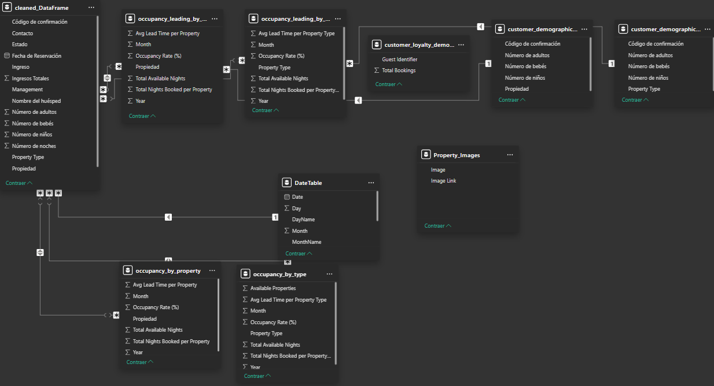
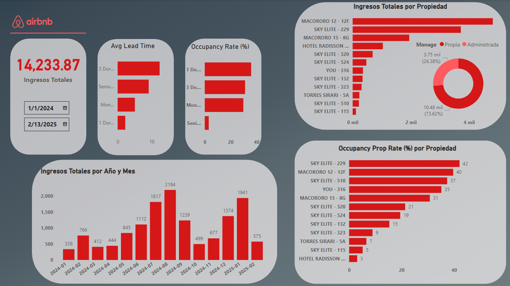
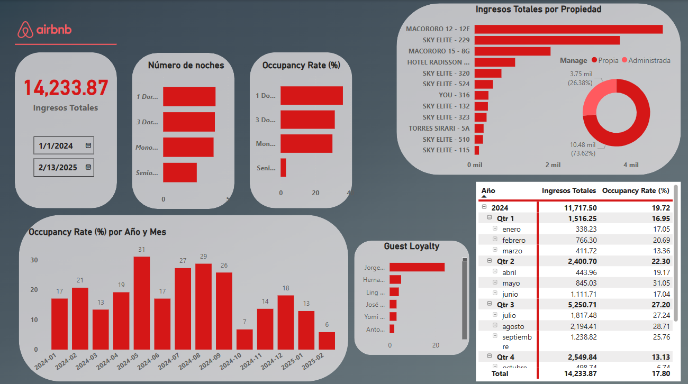
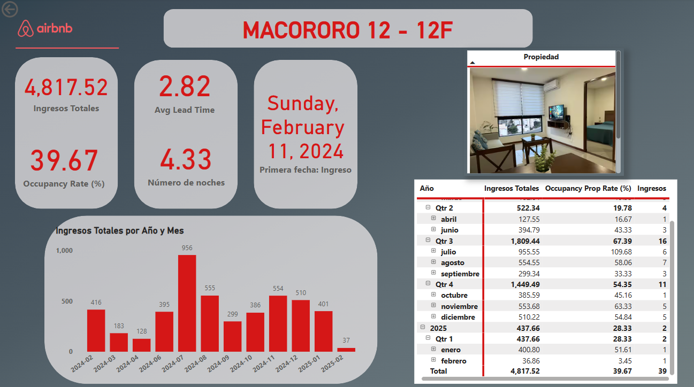

# AIRBNB Dashboard for data analysis
It's aims is to find insights from the data we have about the properties offered on AirBNB

# Blank Canvas with the tables needed for the analysis already imported
We will begin with the visualization of the data

# First canvas for general anlysis, Range of dates, total earnings, earnings per year/month, occupancy rate % per property

# Still planning how the general analysis dashboard will be, I'm inclined on adding more card visualizations and delete the donut one, due to almost all our customers are adults.

# Final canvas for the general analysis dashboard, with the new corrected data frames

# Relationships between tables, to ensure a dynamic dashboard

# Analysis Dashboard Completed, no more editions will be made a part from updating the data, or new properties been introduced. All elements have dynamic features and drillthrough component was used.

# General Anlysis Dashboard

# General Analysis OR(%)

# Detalle por Propiedad
